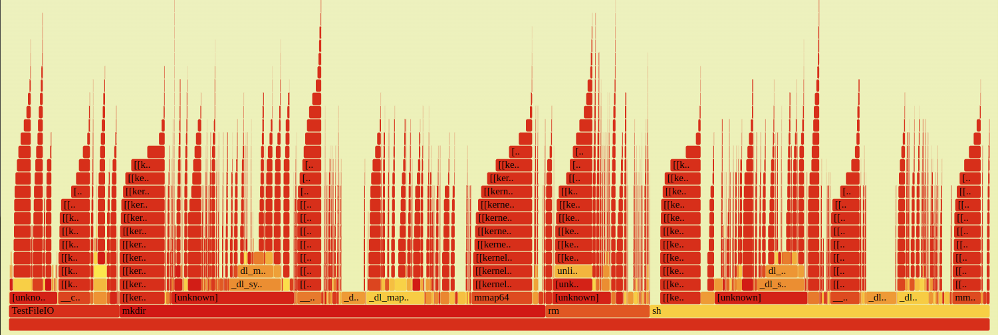
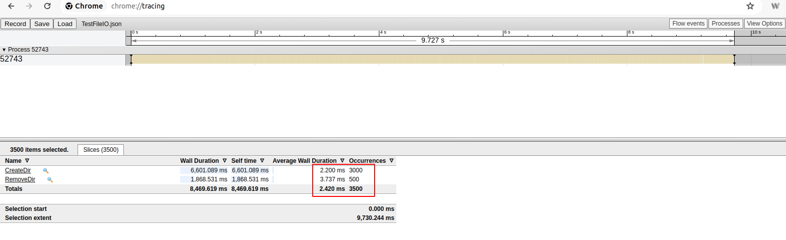
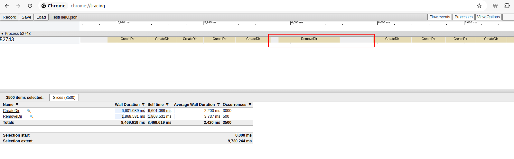
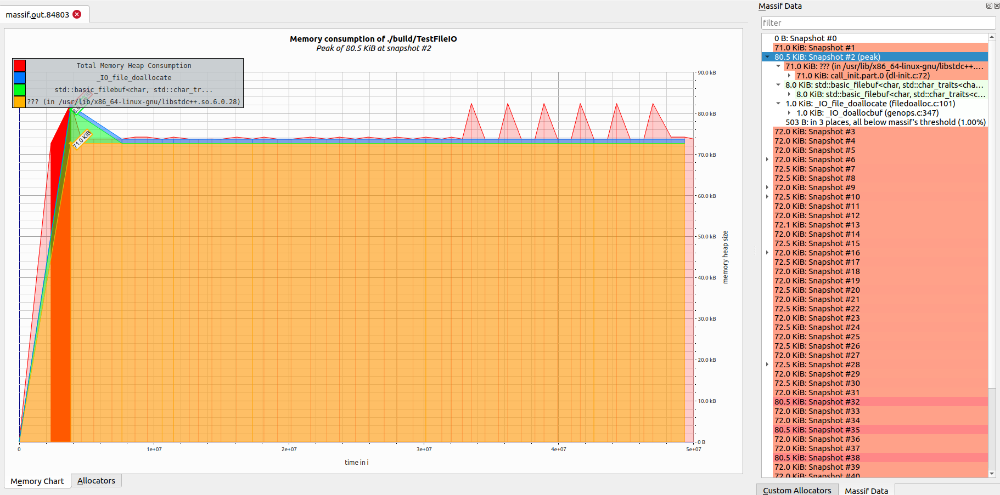

# Code Performance Analysis

This repository contains code samples for performance analysis, available in different branches.

## Compile

To compile the project, run the following commands:

```bash
# Create and navigate to the build directory
mkdir build && cd build

# Generate the build configuration
cmake ..
```

## Performance Profiling with `perf`

Use the following steps to record and analyze performance data:

```bash
# Record performance data while running the executable
perf record -e cpu-clock -g ./TestFileIO

# Convert recorded data to a human-readable format
perf script -i perf.data > out.perf

# Convert perf data to a flame graph using the FlameGraph tool
FlameGraph/stackcollapse-perf.pl out.perf > out.folded
FlameGraph/flamegraph.pl out.folded > result.svg
```

## Tracing

To enable tracing, recompile the program with tracing enabled:

```bash
# Enable trace support during compilation
cmake -DENABLE_TRACE=ON ..

# Run the program with elevated privileges
sudo ./TestFileIO

# Capture trace data and convert it to Chrome Trace JSON format
sudo cat /sys/kernel/debug/tracing/trace_pipe > trace_output.txt
python3 convert.py -i trace_output.txt -o trace.json
```

To visualize the trace data:

1. Open **Google Chrome**.
2. Navigate to `chrome://tracing`.
3. Load the generated `trace.json` file.

For details on the Chrome trace format, refer to the official documentation (see Reference [1]).

**Note:** For a C-based solution that directly generates a trace JSON file, check out: [minitrace](https://github.com/hrydgard/minitrace)

## Memory Profiling with Valgrind

Use `valgrind` to analyze memory usage:

```bash
# Run memory profiling using massif
valgrind --tool=massif --stacks=yes ./TestFileIO

# Install visualization tool (Ubuntu)
sudo apt install massif-visualizer
```

## Performance Analysis Demo

In this section, we demonstrate how to analyze the performance of the code using the tools mentioned above. The target file includes two interfaces implemented in different ways:

```cpp
/**
 * @brief Creates a directory at the specified path. If any parent directories
 *        do not exist, they will be created as well.
 *
 * @param szPath The path of the directory to be created.
 * @return True if the directory is successfully created, false otherwise.
 *         If an error occurs, the appropriate error number is set.
 */
bool CreateDir(const std::string& szPath);

/**
 * @brief Removes a directory at the specified path. Deletes all files and
 *        subdirectories recursively.
 *
 * @param szPath The path of the directory to be removed.
 * @param bSaveParentPath If true, the specified directory itself will be
 *                        preserved, but its contents will be deleted.
 * @return True if the directory is successfully removed, false otherwise.
 *         If an error occurs, the appropriate error number is set.
 */
bool RemoveDir(const std::string& szPath, bool bSaveParentPath);

```

We will use `CreateDir` to create hundreds of folders, populate them with random files and symbolic links, and then remove them using `RemoveDir`. This will allow us to evaluate the performance of directory creation and deletion operations under different conditions.

#### Solution1



The flame graph above highlights several time-consuming operations: `mkdir`, `rm`, and `sh`. This indicates that the test application repeatedly forked shell processes, which then executed `mkdir` and `rm` commands.





The tracing details above show the function occurrences and average durations. If we zoom in, we can see that since the implementation uses `system` to invoke the `rm` and `mkdir` commands, subprocess initialization can take time and eventually become a bottleneck.



The Massif visualization above displays memory consumption, providing detailed insights into the heap memory usage of each function. This information can be valuable when making trade-offs between time and space complexity optimizations.

# References:

1. https://docs.google.com/document/d/1CvAClvFfyA5R-PhYUmn5OOQtYMH4h6I0nSsKchNAySU/preview
